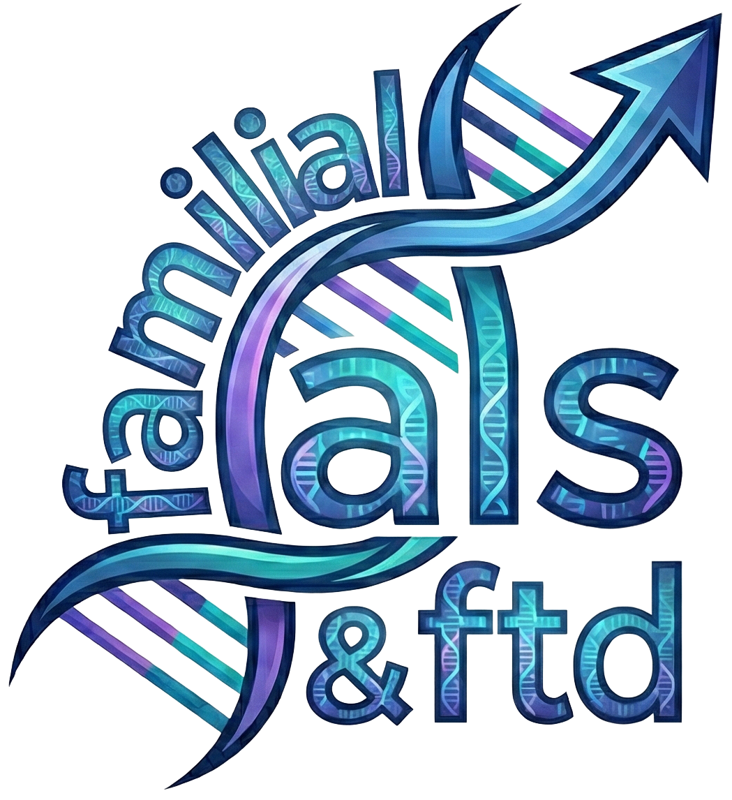

<p align="center">
  
</p>

# Clinical Trial Research Dashboard
> **Note**: This project is a work in progress.

A comprehensive research dashboard focused on ALS/FTD interventional drug research, integrating automated data pipelines, a modern React frontend, and business intelligence analytics.

## Introduction
As part of a non-profit/volunteer contribution, this repository contains a Dashboard summarizing the current and historical state of ALS/FTD research, with a preliminary focus on interventional drug research and familial (genetic) ALS/FTD data exploration.

### fALS: Personal Impact Summary
Within my lifetime, I have witnessed SOD1 Familial ALS claim the lives of my grandmother, my uncle, my father, and most recently my aunt. Our greater extended family has also suffered losses. [Click here to learn more about fALS's impact on my family and I.](https://www.iamals.org/stories/tucker-olson-2/)

If you appreciate this work and would like to suppport it, please remit donations to:
- [Everything ALS](https://www.everythingals.org/donate)
- [ALS Hope Foundation](https://www.alshf.org/donate)
- [I AM ALS](https://www.iamals.org/give/)

---

## Technology Stack

### Frontend
- **React 19**: Modern UI library for building interactive interfaces.
- **Vite**: Next-generation frontend tooling.
- **TailwindCSS**: Utility-first CSS framework.
- **Shadcn/UI**: Re-usable components built using Radix UI and Tailwind CSS.
- **Recharts**: Redefined chart library built with React and D3.

### Backend
- **Django 4**: High-level Python web framework.
- **Django Ninja**: Fast web framework for building APIs with Django and Python 3.6+ type hints.
- **PostgreSQL**: Open source object-relational database system.

### Infrastructure & Analytics
- **Docker**: Containerization for Metabase, PostgreSQL, and Adminer.
- **Metabase**: Open-source Business Intelligence tool, embedded into the React frontend.
- **Adminer**: Database management in a single PHP file.

## Architecture
The application consists of three main components:
1.  **Frontend (React/Vite)**: Serves the user interface and embeds Metabase dashboards.
2.  **Backend (Django API)**: Manages data ingestion (ClinicalTrials.gov), processing, and serves API endpoints.
3.  **Infrastructure (Docker)**: hosts the Persistence layer (PostgreSQL) and the Analytics engine (Metabase).

## Quick Start

### Prerequisites
- [Docker & Docker Compose](https://www.docker.com/products/docker-desktop/)
- [Python 3.14.2+](https://www.python.org/downloads/)
- [Node.js 18+](https://nodejs.org_en/)

### 1. Environment Setup
Copy the example environment file:
```bash
cp .env.example .env
```
Update `.env` with your specific configuration if necessary (the defaults work for local dev).

### 2. Infrastructure (Docker)
Start the database and Metabase containers:
```bash
docker-compose up -d
```
> This starts PostgreSQL on port `5432`, Metabase on `3000`, and Adminer on `8080`.

### 3. Backend (Django)
Create a virtual environment and install dependencies:
```bash
# Create/Activate Virtual Env (Recommended)
python3 -m venv venv
source venv/bin/activate

# Install Dependencies
pip install -r requirements.txt
```

Run migrations and start the server:
```bash
# Run Database Migrations
python manage.py migrate

# Start Django Development Server
python manage.py runserver
```
The API will be available at `http://localhost:8000/api/docs`.

### 4. Frontend (React)
Navigate to the frontend directory and install dependencies:
```bash
cd frontend
npm install
```

Start the Vite development server:
```bash
npm run dev
```
The application will be running at `http://localhost:5173`.

---

## Data Pipeline & LLM
The project includes an automated pipeline to fetch data from ClinicalTrials.gov and enrich it using Local LLMs (via LM Studio or similar OpenAI-compatible endpoints) for:
- **Zero-Shot Classification**: Determining eligibility criteria.
- **Text Classification**: Identifying drug interventions.
- **Summarization**: simplifying complex medical descriptions.

## Metabase Integration
Metabase is used for advanced analytics and is embedded into the React Dashboard. 
- Access the full Metabase instance at `http://localhost:3000`
- Default credentials should be configured in `.env` or set up on first launch.
