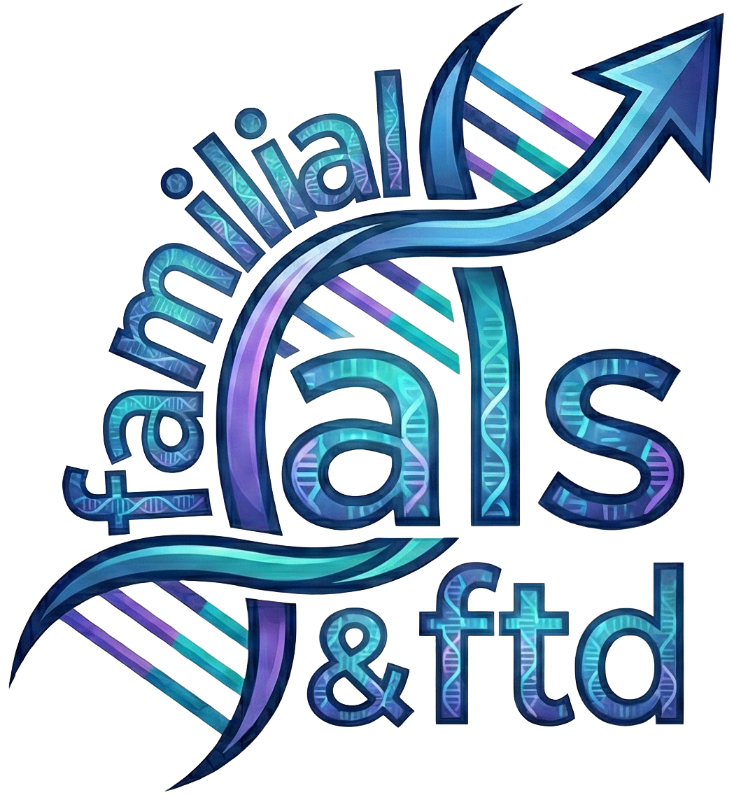
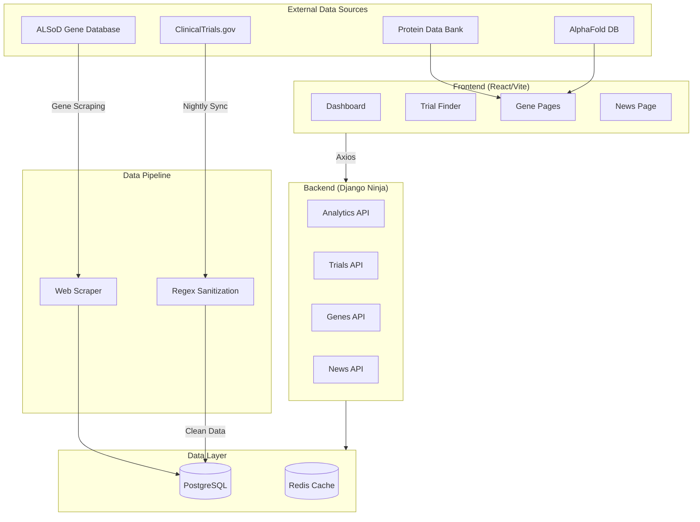

<p align="center">
  
</p>

# Familial ALS & FTD Research Dashboard

> A comprehensive research dashboard focused on familial ALS/FTD interventional drug research, featuring clinical trial analytics, gene-specific data, 3D protein structure visualization, and AI-powered data enrichment.

## Introduction

This open-source dashboard aggregates and visualizes clinical trial data for the familial ALS and FTD research community. It provides researchers, patients, and caregivers with actionable insights into ongoing and historical interventional drug trials.

### Personal Impact

Within my lifetime, I have witnessed SOD1 Familial ALS claim the lives of my grandmother, my uncle, my father, and most recently my aunt. [Learn more about fALS's impact on my family.](https://www.iamals.org/stories/tucker-olson-2/)

If you appreciate this work and would like to support ALS research, please consider donating to:
- [Everything ALS](https://www.everythingals.org/donate)
- [ALS Hope Foundation](https://www.alshf.org/donate)
- [I AM ALS](https://www.iamals.org/give/)

---

## Architecture



---

## Features

### Dashboard & Analytics
- **Interactive Dashboard**: Real-time statistics on trial phases, recruitment status, funding sources, and geographic distribution
- **Trial Finder**: Advanced search and filtering with sortable tables, map visualization, and detailed trial cards
- **Phase Distribution Charts**: Visual breakdown of trials by clinical phase
- **Funding Analysis**: Breakdown by sponsor type (Industry, NIH, Academic, etc.)

### Gene Pages
- **Gene Overview**: Detailed information for 24+ ALS/FTD-related genes
- **3D Protein Structure Viewer**: Interactive molecular visualization using PDBe Molstar
- **PDB & AlphaFold Integration**: Experimental structures and AI-predicted models
- **Gene-Specific Trials**: Filtered clinical trials targeting each gene
- **Gene-Specific News**: Curated research news for each genetic marker

### News Aggregator
- **Multi-Source News Feed**: Aggregated articles from ALS News Today, research journals, and press releases
- **Date Range Filtering**: Calendar-based article filtering
- **Gene Tagging**: Articles tagged and linked to relevant genes

### Data Pipeline
- **ClinicalTrials.gov Integration**: Automated nightly data sync
- **Local LLM Processing**: AI-powered eligibility criteria extraction and classification
- **Gene-Trial Association**: Automatic linking of trials to genetic markers

---

## Technology Stack

### Frontend
| Technology | Purpose |
|------------|---------|
| **React 19** | Modern UI library with hooks and concurrent features |
| **Vite** | Next-generation frontend build tooling |
| **TailwindCSS** | Utility-first CSS framework |
| **shadcn/ui** | Accessible components built on Radix UI |
| **Recharts** | React charting library built with D3 |
| **React Leaflet** | Interactive maps for trial locations |
| **PDBe Molstar** | 3D molecular structure visualization |

### Backend
| Technology | Purpose |
|------------|---------|
| **Django 4** | High-level Python web framework |
| **Django Ninja** | Fast, async-ready API framework with type hints |
| **PostgreSQL** | Primary database with full-text search |
| **Redis** | Caching layer for API responses and rate limiting |
| **Gunicorn** | Production WSGI server |

### Data Processing
| Technology | Purpose |
|------------|---------|
| **Regex Patterns** | Multi-layer text sanitization and normalization |
| **BeautifulSoup** | Web scraping for ALSoD gene data |

### Infrastructure
| Technology | Purpose |
|------------|---------|
| **Docker Compose** | Container orchestration for development |
| **Nginx** | Reverse proxy and static file serving (production) |

---

## Quick Start

### Prerequisites
- [Docker & Docker Compose](https://www.docker.com/products/docker-desktop/)
- [Python 3.11+](https://www.python.org/downloads/)
- [Node.js 18+](https://nodejs.org/)

### 1. Environment Setup
```bash
cp .env.example .env
# Update .env with your configuration
```

### 2. Infrastructure (Docker)
Start PostgreSQL and Redis:
```bash
docker-compose up -d
```
> This starts PostgreSQL on port `5432` and Redis on port `6379`.

### 3. Backend (Django)
```bash
# Create virtual environment
python3 -m venv venv
source venv/bin/activate

# Install dependencies
pip install -r requirements.txt

# Run migrations
python manage.py migrate

# Sync gene structures (for 3D viewer)
python manage.py sync_gene_structures

# Start development server
python manage.py runserver
```
API documentation: `http://localhost:8000/api/docs`

### 4. Frontend (React)
```bash
cd frontend
npm install
npm run dev
```
Application: `http://localhost:5173`

---

## Environment Variables

| Variable | Description | Default |
|----------|-------------|---------|
| `DATABASE_URL` | PostgreSQL connection string | `postgres://...` |
| `REDIS_URL` | Redis connection string | `redis://localhost:6379` |
| `LLM_API_URL` | Local LLM endpoint | `http://localhost:1234/v1` |
| `LLM_MODEL` | Model name for LLM inference | `local-model` |
| `DEBUG` | Django debug mode | `True` |

---

## Data Sources

- **ClinicalTrials.gov**: Primary source for clinical trial data (public API)
- **PDB (Protein Data Bank)**: Experimental 3D protein structures
- **AlphaFold DB**: AI-predicted protein structures from DeepMind
- **ALS News Today**: News aggregation (with permission)

---

## Contributing

Contributions are welcome! Please open an issue or submit a pull request.

## License

This project is open-source and available under the MIT License.

---

## Contact

For questions about this project or collaboration opportunities:
- **Email**: tuckerolson13@gmail.com
- **GitHub Issues**: [Open an issue](https://github.com/tuckthomas/ALS-FTD-Dashboard/issues)
