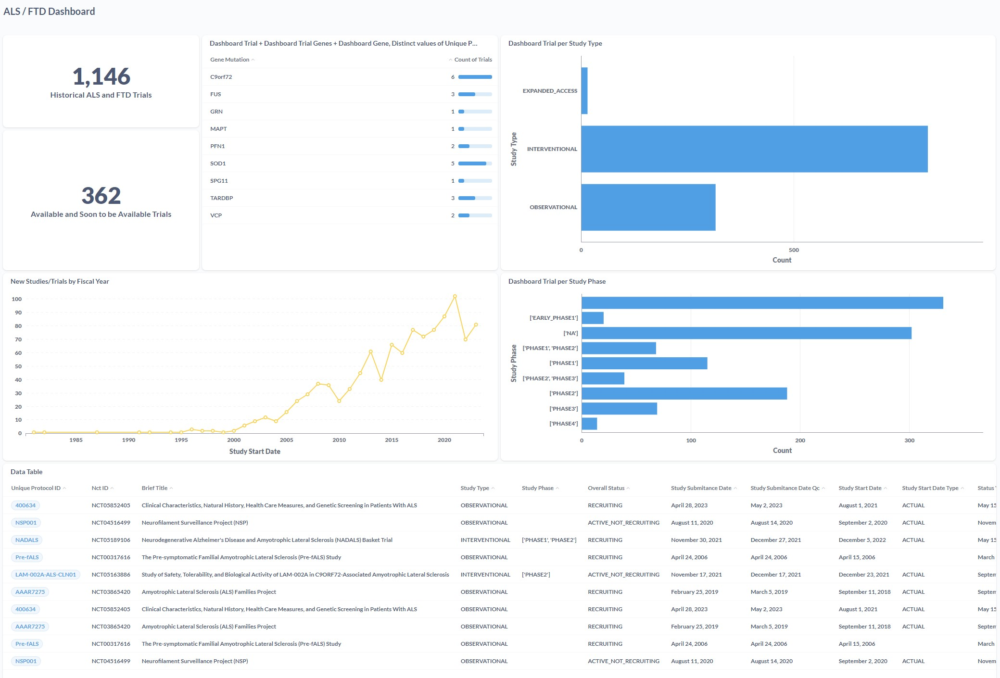

<p align="center">
  
</p>

<h1 align="center">Clinical Trial Research Dashboard</h1>
<h2 align="center"><a href="https://www.f-als.com">f-ALS.com</a></h2>

As part of a non-profit/volunteer contribution, this is the repository to a Dashboard summarizing the current and historical state of ALS/FTD research, with a preliminary focus on familial ALS/FTD; allowing for further data exploration.

**This is a work in progress.** The API functionaltiy retrieving ClinicalTrials.gov fields, performing initial data normalization and validation, and saving the data to the database is working for the intitial identified fields. Additional fields will continue to be added, when appropriate. Furthermore, API fetches of clinical trial data from other countries will be included at a later date. **Lastly, I still have quite a bit of data cleanup, normalization, and validation to complete.** I am sharing this as-is in case anyone is interested in contributing. If you are interested, please contact me at tuckerolson13@gmail.com.

## fALS: Personal Impact Summary
Within my lifetime, I have witnessed SOD1 Familial ALS claim the lives of my grandmother, my uncle, my father, and most recently my aunt. Our greater extended family has also suffered losses. [Click here to learn more about fALS's impact on my family and I.](https://www.iamals.org/stories/tucker-olson-2/)

If you appreciate this work and would like to suppport it, please remit donations to one of the following charities charities listed below. ***Also, I'm available for full-time employment, as well as contract opportunities.***
- [Everything ALS](https://www.everythingals.org/donate)
- [ALS Hope Foundation](https://www.alshf.org/donate)


## Public API
To allow others to easily obtain and customize the same dataset built here, I have chosen Django Ninja API. Currently, only a single API end-point is created. However, at a later date in the near future, additional API end-points will be created.

## How are you creating a genetic mutation field?
Within the utils.py file is a function that scrapes the ALS online Database's HTML table to obtain the Gene Symbol, Gene Name, and Category data. Within a separate function, a 'search and match' of the 'keywords' field occurs using the Gene Symbols and the Gene Name. If a match is found, the Gene Symbol is added to the 'Genes' JSON array.

The web scrapping will only occur every 30 days. When the cron-job occurs at 3:00 AM every night, triggering the function, if the current date is less than 30 days from the date of the last web scrap, the function will intead retrieve existing data saved to the database.

**Citation:** ALSoD. (n.d.). *Amyotrophic Lateral Sclerosis online Database*  from [ALSoD](https://alsod.ac.uk/).

## How can I download your raw dataset in the meantime?
By vising [f-als.com](https://www.f-als.com) and viewing the 'Raw Data' tab of the dashboard, there is an option in the upper right-hand corner of the table. Selecting the option will provide a drop-down menu allowing the site visitor the following extraction options:
- CSV
- XLSX
- JSON

Additionally, .png files of dashboard visualizations may also be downloaded.

# System Requirements
This project depends on several Python packages. Below is a breakdown of the required packages, along with optional dependencies if you're using PostgreSQL as your database.

**Python Version:** 3.9.2

## Django and Core Dependencies
These packages are required for the project to run:

- `Django==4.2.10` - The web framework used.
- `django-ninja==1.1.0` - For building APIs with Django.
- `beautifulsoup4==4.12.3` - For parsing HTML and XML documents.
- `numpy==1.26.4` - For numerical operations.
- `pandas==2.2.0` - For data manipulation and analysis.
- `openpyxl==3.1.2` - For reading/writing Excel 2010 xlsx/xlsm files.
- `pydantic==2.6.1` - Data validation and settings management using python type annotations.
- `ipython==7.20.0` - For interactive computing.
- `requests==2.25.1` - For making HTTP requests.
- `whitenoise==6.6.0` - For serving static files.
- `fuzzywuzzy==0.18.0 ` - For fuzzy string matching, useful in scenarios where you need to find close matches to strings.
- `python-Levenshtein` - Provides a faster, C-based extension for the FuzzyWuzzy library to speed up string comparison operations.

## Optional Metabase Front-End Requirements
**What is Metabase?** [Metabase](https://github.com/metabase/metabase) is open-source business intelligence tool that enables users to explore, visualize, and share data insights without the need for extensive technical knowledge. It allows for easy querying through a user-friendly interface, making it accessible for users to generate reports and dashboards from their data sources.

To use Metabase as the dashboard front-end, Docker is required for installation. Ensure Docker is installed and running on your system. I am running Debian 12 within a Proxmox LXC. If using a similar setup or Debian-based system, here's how to install Metabase using Docker:

- Ensure Docker is installed on your system. For Debian-based systems:
  ```sh
  apt-get update
  apt-get install apt-transport-https ca-certificates curl gnupg lsb-release
  curl -fsSL https://download.docker.com/linux/debian/gpg | gpg --dearmor -o /usr/share/keyrings/docker-archive-keyring.gpg
  echo "deb [arch=$(dpkg --print-architecture) signed-by=/usr/share/keyrings/docker-archive-keyring.gpg] https://download.docker.com/linux/debian $(lsb_release -cs) stable" | tee /etc/apt/sources.list.d/docker.list > /dev/null
  apt-get update
  apt-get install docker-ce docker-ce-cli containerd.io

- Pull latest Metabase image from Docker and run Metabase:
  ```sh
  docker pull metabase/metabase:latest
  docker run -d -p 3000:3000 --name metabase metabase/metabase # Replace Port '3000' with Different Port if Desired
  
- Install PyJWT for Embedding Metabase Dashboard into Webpage:
  ```sh
  pip install PyJWT

Here is an early example of a dashboard using Metabase:



## Database Drivers
I opted to use my existing PostgreSQL database. Depending on your database choice, you might need specific drivers:

- `mysqlclient==1.4.4` - A MySQL driver (Optional, only if using MySQL).
- `psycopg2-binary==2.9.9` - A PostgreSQL driver (Optional, specifically for PostgreSQL users).

## Other Dependencies
The following packages might be used for specific functionalities within the project. They are not strictly required for the core functionality but may enhance the project's capabilities or are dependencies of the above packages:

- `asgiref==3.7.2`
- `certifi==2020.6.20`
- `chardet==4.0.0`
- `cryptography==3.3.2`
- `idna==2.10`
- `python-dateutil==2.8.2`
- `pytz==2021.1`
- `sqlparse==0.4.1`
- `urllib3==1.26.5`

## Optional Packages
These packages are optional and might be required under specific circumstances or for development purposes:

- `ipython_genutils==0.2.0`, `jedi==0.18.0`, `parso==0.8.1`, `pexpect==4.8.0`, `pickleshare==0.7.5`, `prompt-toolkit==3.0.14`, `Pygments==2.7.1`, `traitlets==5.0.5`, `wcwidth==0.1.9` - For enhanced IPython interaction.
- `pyOpenSSL==20.0.1`, `pycurl==7.43.0.6`, `pycurl-wrapper===2.0-2-g027c28a` - For secure connection handling and HTTP requests.
