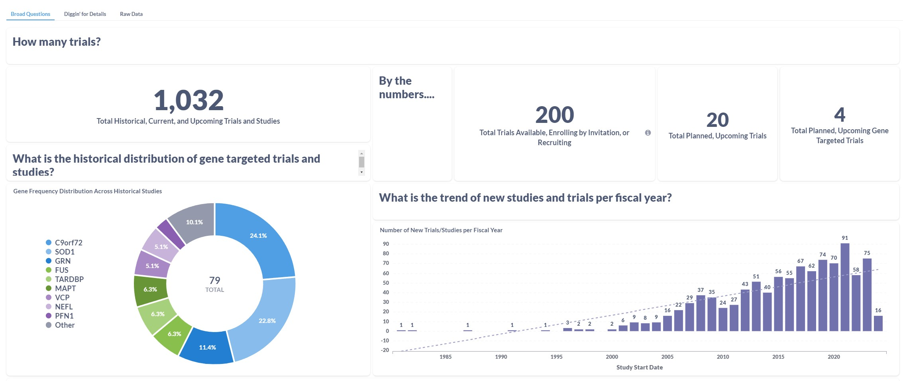

<p align="center">
  
</p>

<h1 align="center">Clinical Trial Research Dashboard</h1>

# Introduction
As part of a non-profit/volunteer contribution, this is the repository to a Dashboard summarizing the current and historical state of ALS/FTD research, with a preliminary focus on interventional drug research with data exploration regarding familial (genetic) ALS/FTD.

**This is a work in progress.** The API functionaltiy retrieving ClinicalTrials.gov fields, performing initial data normalization and validation, and saving the data to the database is working for the intitial identified fields. Additional fields will continue to be added, when appropriate. Furthermore, API fetches of clinical trial data from other countries will be included at a later date. **Lastly, I still have quite a bit of data cleanup, normalization, and validation to complete.** I am sharing this as-is in case anyone is interested in contributing. If you are interested, please contact me at tuckerolson13@gmail.com.

## fALS: Personal Impact Summary
Within my lifetime, I have witnessed SOD1 Familial ALS claim the lives of my grandmother, my uncle, my father, and most recently my aunt. Our greater extended family has also suffered losses. [Click here to learn more about fALS's impact on my family and I.](https://www.iamals.org/stories/tucker-olson-2/)

If you appreciate this work and would like to suppport it, please remit donations to one of the following charities charities listed below. ***Also, I'm available for full-time employment, as well as contract opportunities.***
- [Everything ALS](https://www.everythingals.org/donate)
- [ALS Hope Foundation](https://www.alshf.org/donate)
- [I AM ALS](https://www.iamals.org/give/)

# Local Large Language Model (AI)
## Introduction
Due to the inconsistent quality and wide range of variability of description fields,  I am in the beginning stages of experimentig with a locally hosted large language model.

## Hardware Limitations, Processing Time, and Data Output Quality
I am using LM Studio on my home desktop computer, using it to host a local server. While my desktop does have an NVIDIA RTX GPU, it is a first-generation RTX model (MSI RTX 2070; 8GB VRAM). Therefore, the processing time and end results (due to having to run smaller models) may vary. If it is determined that multiple LLM models will need to be utilized, I might allocate my media server's GPU (GTX 1070 TI; 8 GB VRAM) during the daily cron-job occurence.

## LLM Types and Approach
I will start with small batches of records and have them save to a separate database table with a foreign key to the Trials table. I'll then evaluate the output before expanding further. One area to tackle is using the LLM(s) to fill in missing data fields by using the text-input description fields that have been frequently used by trial sponsors. I'm evaluating which LLM model-types to use, though am notating the following:
- `Zero-Shot Classification` - To interpret the Eligibility Criteria Description field and determine which, if any, of the existing null fields can be populated with data.
- `Text Classification` - To interpret the various Intervention fields and classify whether a drug/treatment intervention is occuring (i.e., the hypothesis). If the class returned is 'entailment' (i.e., hypothesis is true), then the database updates the record's custom added field, 'DRUG_INTERVENTION', as 'TRUE'.
- `Summarization` - To interpret and summarize Eligibility Criteria Descrptions and output in a consistent, reader-friendly format.

## Initial LLM Test Data
- I am currently actively testing the Gemma IT 2b by having it provide me two separate JSON lists of inclusion and exclusion criteria when providing the AI with the eligibility_description (text field).

# Public API
To allow others to easily obtain and customize the same dataset built here, I have chosen Django Ninja API. Currently, only a single API end-point is created. However, at a later date in the near future, additional API end-points will be created.

Once additional API endpoints have been created, I will update this section with the appropraite API information.

# Noteworthy Changes to Data Structure
## Expanded Access Field, Study Phase Field
Opposed to two separate fields, I have included a function that will change a given record's indicated study phase (if NA or null) to 'EAP' if its Expanded Access field is equal to TRUE.

## Gene Mutation Field
**Note: Web scrapping permission has been receivd from Dr. Al-Chalabi at Kings College.** Within the utils.py file is a function that scrapes the ALS online Database's HTML table to obtain the Gene Symbol, Gene Name, and Category data. Within a separate function, a 'search and match' of the 'keywords' field occurs using the Gene Symbols and the Gene Name. If a match is found, the Gene Symbol is added to the 'Genes' JSON array.

## Eligibility Inclusion and Exclusion Description Fields
The AI essentially looks at the eligibility_criteria_description and creates two separate bulleted lists: (1) inclusion criteria and (2) exclusion criteria. Then, saves those lists as JSON fields within the record. This field is still under development and in need of further AI refinement. An early issue I noticed is that there are special characters within many of the list items that aren't being removed before posting to the database. Therefor, the fields reamin in need of additional cleanup and subsequent data validation.

The web scrapping will only occur every 30 days. When the cron-job occurs at 3:00 AM every morning, triggering the function, if the current date is less than 30 days from the date of the last web scrap, the function will instead retrieve existing data saved to the database. To avoid confusion, the API pull will continue to occur each morning due to the frequency of ClinicalTrials.gov updates.

**Citation:** ALSoD. (n.d.). *Amyotrophic Lateral Sclerosis online Database*  from [ALSoD](https://alsod.ac.uk/).

# How can I download your raw dataset in the meantime?
By vising [f-als.com](https://www.f-als.com) and viewing the 'Raw Data' tab of the dashboard, there is an option in the upper right-hand corner of the table. Selecting the option will provide a drop-down menu allowing the site visitor the following extraction options:
- CSV
- XLSX
- JSON

Additionally, .png files of dashboard visualizations may also be downloaded.

# System Requirements
This project depends on several Python packages. Below is a breakdown of the required packages, along with optional dependencies if you're using PostgreSQL as your database.

**Python Version:** 3.9.2

## Django and Core Dependencies
These packages are required for the project to run:

- `Django==4.2.10` - The web framework used.
- `django-ninja==1.1.0` - For building APIs with Django.
- `beautifulsoup4==4.12.3` - For parsing HTML and XML documents.
- `numpy==1.26.4` - For numerical operations.
- `pandas==2.2.0` - For data manipulation and analysis.
- `openpyxl==3.1.2` - For reading/writing Excel 2010 xlsx/xlsm files.
- `pydantic==2.6.1` - Data validation and settings management using python type annotations.
- `ipython==7.20.0` - For interactive computing.
- `requests==2.25.1` - For making HTTP requests.
- `whitenoise==6.6.0` - For serving static files.
- `fuzzywuzzy==0.18.0 ` - For fuzzy string matching, useful in scenarios where you need to find close matches to strings.
- `python-Levenshtein` - Provides a faster, C-based extension for the FuzzyWuzzy library to speed up string comparison operations.
- `openai` - For sending OpenAI Prompt to local HTTP server containing Large Language Model.

## Optional Metabase Front-End Requirements
**What is Metabase?** [Metabase](https://github.com/metabase/metabase) is open-source business intelligence tool that enables users to explore, visualize, and share data insights without the need for extensive technical knowledge. It allows for easy querying through a user-friendly interface, making it accessible for users to generate reports and dashboards from their data sources.

To use Metabase as the dashboard front-end, Docker is required for installation. Ensure Docker is installed and running on your system. I am running Debian 12 within a Proxmox LXC. If using a similar setup or Debian-based system, here's how to install Metabase using Docker:

- Ensure Docker is installed on your system. For Debian-based systems:
  ```sh
  apt-get update
  apt-get install apt-transport-https ca-certificates curl gnupg lsb-release
  curl -fsSL https://download.docker.com/linux/debian/gpg | gpg --dearmor -o /usr/share/keyrings/docker-archive-keyring.gpg
  echo "deb [arch=$(dpkg --print-architecture) signed-by=/usr/share/keyrings/docker-archive-keyring.gpg] https://download.docker.com/linux/debian $(lsb_release -cs) stable" | tee /etc/apt/sources.list.d/docker.list > /dev/null
  apt-get update
  apt-get install docker-ce docker-ce-cli containerd.io

- Pull latest Metabase image from Docker and run Metabase:
  ```sh
  docker pull metabase/metabase:latest
  docker run -d -p 3000:3000 --name metabase metabase/metabase # Replace Port '3000' with Different Port if Desired
  
- Install PyJWT for Embedding Metabase Dashboard into Webpage:
  ```sh
  pip install PyJWT

Here is an early example of a dashboard using Metabase:



## Database Drivers
I opted to use my existing PostgreSQL database. Depending on your database choice, you might need specific drivers:

- `mysqlclient==1.4.4` - A MySQL driver (Optional, only if using MySQL).
- `psycopg2-binary==2.9.9` - A PostgreSQL driver (Optional, specifically for PostgreSQL users).

## Other Dependencies
The following packages might be used for specific functionalities within the project. They are not strictly required for the core functionality but may enhance the project's capabilities or are dependencies of the above packages:

- `asgiref==3.7.2`
- `certifi==2020.6.20`
- `chardet==4.0.0`
- `cryptography==3.3.2`
- `idna==2.10`
- `python-dateutil==2.8.2`
- `pytz==2021.1`
- `sqlparse==0.4.1`
- `urllib3==1.26.5`

## Optional Packages
These packages are optional and might be required under specific circumstances or for development purposes:

- `ipython_genutils==0.2.0`, `jedi==0.18.0`, `parso==0.8.1`, `pexpect==4.8.0`, `pickleshare==0.7.5`, `prompt-toolkit==3.0.14`, `Pygments==2.7.1`, `traitlets==5.0.5`, `wcwidth==0.1.9` - For enhanced IPython interaction.
- `pyOpenSSL==20.0.1`, `pycurl==7.43.0.6`, `pycurl-wrapper===2.0-2-g027c28a` - For secure connection handling and HTTP requests.
